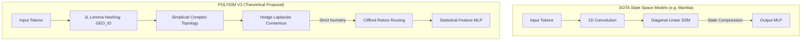

  <h1>🌌 POLYDIM V3</h1>
  
<b>An Applied Topological Engine: Exploring Clifford Algebras and Hodge Laplacians as Isometric State Routers</b>

  
  
  
  

---

## 🛑 The Context: The KV-Cache Wall & State Space Models

State-of-the-art Large Language Models (LLMs) rely on the classical Transformer architecture. While extremely expressive, they suffer from a fundamental mathematical bottleneck: **Dense Attention** ($\mathcal{O}(N^2)$).

Modern architectures like **Mamba (Gu & Dao, 2023)** and **SparseK Attention (Lou et al., 2024)** have successfully achieved linear $\mathcal{O}(N)$ complexity. However, compressing contexts into fixed-size latent states (SSMs) relies on diagonal linear updates that can struggle to maintain exact, high-dimensional geometric relationships across extremely long contexts (Catastrophic Forgetting).

## 📐 The Polydim Hypothesis

**POLYDIM V3** explores a theoretical alternative: instead of compressing state linearly, can we route tokens geometrically without losing structural integrity? 

We propose a **Topological Execution Engine** that maps sequences to Simplicial Complexes and achieves global consensus via Sparse Hodge Laplacians. To prevent the entropy degradation typical of continuous neural updates, state memory is routed via **Clifford Algebra Rotors** (Householder reflections). As proven by W.K. Clifford (1878), these reflections strictly preserve the $\mathcal{L}_2$ norm, guaranteeing 100% isometry across state transitions.

### Architectural Comparison

## 🚀 The Hybrid Engine (V3 Core)

POLYDIM V3 separates concerns into two distinct computational spaces:

1. **Statistical Space (Learning):** Uses standard PyTorch MLPs to extract features and learn representations (Backpropagation).
2. **Topological Space (Routing):** Information is projected onto a massive $10,000D$ hypersphere. Here, no backpropagation learning occurs on the state vector itself; data is routed across tokens using strict isometric Clifford rotations.

*(Note on Complexity: Because $D=10,000$, POLYDIM is heavily disadvantaged for short sequences ($N < 1000$). Its theoretical crossover point vs dense attention occurs only at massive sequence lengths).*

## 📦 PMTP: Polydim Matrix Transfer Protocol

To prevent **Shadow Loss** (the catastrophic loss of high-dimensional entropy when agents communicate via 1D natural language text), POLYDIM nodes synchronize via **PMTP**, a Rust-based networking protocol that serializes their internal Block-Sparse Row (BSR) tensors for zero-copy IPC.

---

### 📚 Documentation & Academic Integrity
For the mathematical framing of our hypothesis, see our updated foundational document, which acknowledges the limits of our current empirical validation:
- [The Polydim White Book](docs/for_evaluation/POLYDIM_WHITE_BOOK.md)
